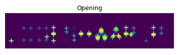

# Opening-and-Closing

## Aim
To implement Opening and Closing using Python and OpenCV.

## Software Required
1. Anaconda - Python 3.7
2. OpenCV
## Algorithm:
### Step1:

Import the necessary packages.
<br>

### Step2:

Create the Text using cv2.putText.
<br>

### Step3:

Create the structuring element.
<br>

### Step4:

Use Opening operation.
<br>

### Step5:

Use Closing Operation.
<br>

## Program:

```
Developed by: LOGESHWARI.P
Reg No: 212221230055
```

 ```
# Import the necessary packages

import numpy as np
import matplotlib.pyplot as plt
import cv2

# Create the Text using cv2.putText

text_image = np.zeros((100,540),dtype = 'uint8')
font = cv2.FONT_HERSHEY_SIMPLEX = 3
cv2.putText(text_image," LOGESHWARI.P",(5,70),font,2,(255),5,cv2.LINE_AA)
plt.title("Original Image")
plt.imshow(text_image)
plt.axis('off')

# Create the structuring element

kernel = cv2.getStructuringElement(cv2.MORPH_CROSS,(11,11))

# Use Opening operation

opening_image = cv2.morphologyEx(text_image,cv2.MORPH_OPEN,kernel)
plt.title("Opening")
plt.imshow(opening_image)
plt.axis('off')

# Use Closing Operation

closing_image = cv2.morphologyEx(text_image,cv2.MORPH_CLOSE,kernel)
plt.title("Closing")
plt.imshow(closing_image)
plt.axis('off')
```
## Output:

### Display the input Image


### Display the result of Opening



### Display the result of Closing


## Result
Thus the Opening and Closing operation is used in the image using python and OpenCV
